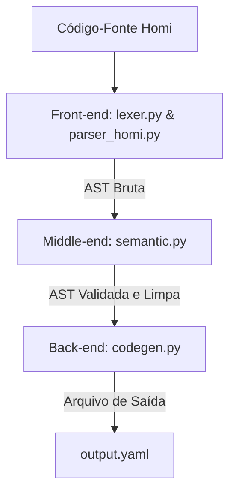

# 📖 Guia de Estudos: `codegen.py`

## 1. Resumo do Papel no Pipeline do Compilador

O **Gerador de Código** (`codegen.py`) é a **fase final (Back-end)** do pipeline do seu compilador.



### Responsabilidade Exata:
O gerador de código tem a missão de traduzir a representação intermediária interna do compilador — a **AST (Árvore de Sintaxe Abstrata)** validada — para a linguagem ou formato de destino. 

No caso da linguagem Homi, o alvo de destino é o formato **YAML estruturado oficial do Home Assistant** (`automations.yaml`).
* Ele percorre os nós da árvore, limpa metadados do compilador (como aspas de strings), traduz expressões simplificadas de tempo em dicionários compreensíveis pelo HA (objeto de delay), injeta metadados obrigatórios de infraestrutura (como a criação de **IDs únicos** por automação) e exporta o arquivo final gravado no disco físico.

---

## 2. Desmembramento Técnico

O coração desta fase é a classe `GeradorYAML`, que adota uma variação estrutural simples do padrão de projeto **Visitor** para navegar nas listas e dicionários que compõem a AST.

### A. Métodos Utilitários e Tradutores

* **`_gerar_id()`** (Linha 27):
  * **O que faz:** Gera uma string numérica única para servir de identificador da automação no banco de dados do Home Assistant. Ela multiplica o timestamp Unix atual (segundos desde 1970) por 1000 para gerar valores com granularidade de milissegundos.
* **`_limpar_string(valor)`** (Linha 37):
  * **O que faz:** Remove as aspas duplas envolventes das strings (ex: transforma `'"disarmed"'` em `'disarmed'`). O Lexer/Parser retém as aspas para proteção léxica, mas o YAML de destino exige as strings cruas.
* **`_parsear_tempo(tempo_str)`** (Linha 42):
  * **O que faz:** O tradutor de grandezas temporais. Ele usa Expressões Regulares (`re.match` e `re.search`) para decodificar strings simplificadas em dicionários de atraso (`delay`) nativos do Home Assistant.
  * **Regras de conversão:**
    * `'10s'` → `{hours: 0, minutes: 0, seconds: 10, milliseconds: 0}`
    * `'5min'` → `{hours: 0, minutes: 5, seconds: 0, milliseconds: 0}`
    * `'2h'` → `{hours: 2, minutes: 0, seconds: 0, milliseconds: 0}`
    * `'1h 2min 3s'` → `{hours: 1, minutes: 2, seconds: 3, milliseconds: 0}`
    * `'1min 45s'` → `{hours: 0, minutes: 1, seconds: 45, milliseconds: 0}`
    * `'01:30:00'` → `{hours: 1, minutes: 30, seconds: 0, milliseconds: 0}`

### B. Métodos de Mapeamento Estrutural (AST → HA Schema)

* **`_gerar_automacao(self, no)`** (Linha 105):
  * Cria o esqueleto base de uma automação conforme o padrão oficial exigido pelo parser de automações do Home Assistant:
    * `id`: identificador gerado dinamicamente.
    * `alias`: o nome limpo da automação.
    * `description`: mantido em branco nesta versão.
    * `triggers`, `conditions` e `actions`: gerados a partir do mapeamento dos sub-blocos.
    * `mode`: obtido dinamicamente do campo `modo` da AST (com fallback para `'single'`).

* **`_gerar_triggers(self, gatilhos)`** (Linha 121):
  * Converte gatilhos geográficos (`gatilho_evento`) para a estrutura `'sun'` do HA, mantendo o `offset` de desvio.
  * Converte gatilhos de estado (`gatilho_estado`) em gatilhos do tipo `'state'` do HA, envelopando a entidade e o estado de destino em formato de lista (`entity_id: [entidade]`, `to: [estado]`).
  * Converte gatilhos numéricos (`gatilho_numerico`) em gatilhos do tipo `'numeric_state'` do HA, com as chaves `above` ou `below` conforme o operador.
  * Converte gatilhos de horário (`gatilho_horario`) em gatilhos do tipo `'time'` do HA, usando o horário de início como referência.

* **`_gerar_conditions(self, condicoes)`** (Linha 173):
  * Converte condições de estado (`condicao_estado`) em condições `'state'` do HA.
  * Converte condições numéricas (`condicao_numerica`) em condições `'numeric_state'` do HA.
  * Converte condições de horário (`condicao_horario`) em condições `'time'` do HA, com as chaves `after` e `before`.

* **`_gerar_actions(self, acoes)`** (Linha 208):
  * Para ações Homi de `LIGAR`/`DESLIGAR`: Extrai o domínio e formata a string do serviço do HA (`f"{dominio}.turn_on"` ou `f"{dominio}.turn_off"`), apontando para a entidade de destino dentro da chave `'target'`.
  * Para ações Homi de `ESPERAR`: Invoca o tradutor de tempo para formatar a chave `'delay'`.

### C. Serialização YAML (Linhas 248-267)
* **`exportar_yaml(self)`**: Usa a biblioteca `yaml` (PyYAML). A linha `yaml.dump(..., sort_keys=False, allow_unicode=True)` é de extrema importância.
  * `sort_keys=False` garante que o YAML gerado respeite rigorosamente a ordem em que as chaves foram adicionadas (mantendo o arquivo fácil de ler por humanos), em vez de ordená-las em ordem alfabética.
  * `allow_unicode=True` permite que acentos em português no nome da automação (como "Pôr do sol na Sala") sejam salvos de forma legível em vez de sequências de escape estranhas (ex: `\u00f4`).

---

## 3. Fluxo de Dados

### 📥 Entrada:
A lista de dicionários correspondente à AST validada sem erros.
```python
[
    {
        'tipo': 'automacao',
        'nome': '"Por do sol"',
        'modo': 'single',
        'gatilhos': [{'tipo': 'gatilho_evento', 'evento': 'sunset', 'offset': '-01:00:00'}],
        'condicoes': [],
        'acoes': [{'tipo': 'acao_ligar', 'entidade': 'light.sala'}]
    }
]
```

### 📤 Saída (Código YAML Compilado):
Uma string formatada contendo a listagem serializada gravada no arquivo de saída:
```yaml
- id: '1685712495000'
  alias: Por do sol
  description: ''
  triggers:
  - event: sunset
    offset: -01:00:00
    trigger: sun
  conditions: []
  actions:
  - action: light.turn_on
    metadata: {}
    data: {}
    target:
      entity_id: light.sala
  mode: single
```

---

## 4. Possíveis Gargalos e Perguntas de Banca ⚠️

Esteja preparado para explicar estes pontos-chave caso o professor tente te encurralar:

### 🔍 Gargalo 1: Geração Não-Determinística de IDs
* **A Fragilidade:** Os IDs das automações são criados com base no relógio do computador (`time.time()`).
* **O Problema:** Se você compilar o exato mesmo código Homi duas vezes, o YAML gerado terá **IDs completamente diferentes**. O Home Assistant interpretará que as automações antigas foram excluídas e novas foram recriadas, perdendo históricos de rastreamento.
* **Pergunta do professor:** *"Como você resolveria essa falta de determinismo na geração de IDs?"*
* **Sua resposta:** *"Para tornar a compilação determinística, nós poderíamos gerar um identificador estável derivando um Hash MD5 ou SHA-256 a partir do nome da automação (o `alias`), que é único no arquivo. Por exemplo, importando a biblioteca `hashlib` e gerando o ID como: `hashlib.md5(no['nome'].encode()).hexdigest()`. Assim, se a automação tiver o mesmo nome, o ID será idêntico em todas as compilações subsequentes."*

### 🔍 Gargalo 2: Limitações Físicas da Tradução de Serviços (Ações)
* **A Fragilidade:** O compilador traduz as ações `LIGAR` e `DESLIGAR` gerando cegamente `dominio.turn_on` e `dominio.turn_off`.
* **O Problema:** A grande maioria das entidades do HA segue essa regra (luzes, interruptores, ventiladores). Mas algumas integrações específicas possuem comandos próprios! Por exemplo, travas elétricas (`lock.sala`) exigem os serviços `lock.lock` e `lock.unlock` (e não `lock.turn_on`/`lock.turn_off`). Se o usuário compilar `- LIGAR lock.sala`, o compilador gerará `lock.turn_on`, e o Home Assistant gerará um erro em tempo de execução.
* **Pergunta do professor:** *"Como você trataria dispositivos cujos comandos de ligar/desligar não seguem o turn_on padrão?"*
* **Sua resposta:** *"Nós poderíamos implementar um mapa de exceções (uma tabela de mapeamento de serviços) dentro do gerador de código. Por exemplo: `EXCECOES_SERVICO = {'lock': {'ligar': 'lock', 'desligar': 'unlock'}}`. Ao gerar a ação, o gerador consultaria essa tabela; caso o domínio estivesse catalogado, aplicaria a ação customizada ao invés de usar a string genérica `turn_on`."*

### 🔍 Gargalo 3: Alterações ao Vivo (Como customizar ou adicionar novos tradutores temporais)
* **O que o professor pode pedir:** *"Quero que a linguagem passe a aceitar tempo em dias no formato de delay das ações (ex: `2d`). Mude a geração de código para dar suporte a isso."*
* **Como resolver ao vivo:**
  Você precisaria de duas alterações:
  1. No `lexer.py`: adicionar `|\d+d` à regex de `t_TEMPO`.
  2. No `codegen.py`: adicionar uma nova cláusula de regex no método `_parsear_tempo` para extrair os dias:
  ```python
  d_match = re.search(r'(\d+)d', tempo_str)
  d = int(d_match.group(1)) if d_match else 0
  ```
  E incluir `d` no dicionário de delay retornado.

---

### Resumo de Dicas para a Apresentação:
1. **Destaque a Legibilidade:** Explique ao professor que a decisão de usar a biblioteca `yaml` oficial mantendo a ordenação das chaves original (`sort_keys=False`) foi de suma importância para garantir que o compilador crie arquivos limpos, legíveis e fáceis de inspecionar visualmente por seres humanos.
2. **Execute a Geração:** A seção `if __name__ == '__main__':` (Linha 275) executa toda a cadeia de tradução e gera o arquivo `automations_gerado.yaml` no disco automaticamente. Execute:
   ```bash
   python codegen.py
   ```
   E exiba o arquivo YAML perfeitamente montado. É a prova irrefutável de que seu gerador de código funciona com maestria!

Parabéns pelo excelente projeto! Agora você tem um portfólio completo de guias para todas as fases do seu compilador. Se precisar de mais alguma análise ou ajuste na sua base de código, estarei à disposição. Arrase na banca!
