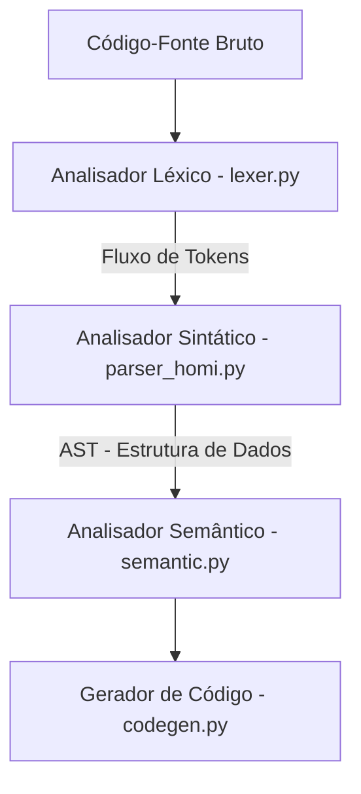

# 📖 Guia de Estudos: `parser_homi.py`

## 1. Resumo do Papel no Pipeline do Compilador

O **Analisador Sintático** (`parser_homi.py`) representa a **segunda fase** do pipeline do compilador da linguagem Homi.



### Responsabilidades Exatas:
1. **Validação Gramatical:** Ele recebe o fluxo linear de tokens do `lexer.py` e valida se a sequência obedece à **Gramática Livre de Contexto (GLC)** definida para a linguagem Homi (por exemplo: se toda automação declarada possui a palavra-chave `AUTOMACAO`, seguida por um nome em string, um modo opcional, blocos válidos de `QUANDO:`, `SE:` (opcional), `FAÇA:` e fecha com a palavra-chave `FIM`).
2. **Construção da AST (Árvore de Sintaxe Abstrata):** O parser não apenas valida o código, mas também traduz o texto sequencial em uma estrutura de dados hierárquica e semântica na memória chamada **AST**. No caso do seu projeto, essa árvore é estruturada como uma árvore de dicionários e listas aninhadas em Python.
3. **Recuperação de Erros Sintáticos:** Caso encontre um erro sintático (como a falta de `:`, ou falta do `FIM`), o parser aplica o **Modo Pânico**, ignorando trechos quebrados e tentando sincronizar o fluxo a partir de um ponto seguro para continuar lendo as outras automações do arquivo.

---

## 2. Desmembramento Técnico

O analisador sintático é baseado no **PLY (Python Lex-Yacc)**, especificamente no módulo `ply.yacc`, que constrói um parser bottom-up do tipo **LALR(1)**.

### A. Anatomia de uma Regra Sintática no PLY (`p_XXXX`)
Cada regra gramatical é declarada através de uma função que começa com `p_`. A *docstring* da função descreve a regra sintática formalmente na notação BNF (Backus-Naur Form).

O argumento `p` passado para a função é do tipo `YaccProduction` e se comporta como uma lista/vetor:
* `p[0]` representa a cabeça da regra sintática (o símbolo não-terminal resultante no lado esquerdo do `:`).
* `p[1]`, `p[2]`, `p[3]`, etc., representam os símbolos e tokens do lado direito da regra (da esquerda para a direita).

### B. Mapeamento das Principais Regras e Construção da AST

* **Regras de Entrada (`p_programa_unico` e `p_programa_lista`):**
  ```python
  def p_programa_unico(p):
      '''programa : automacao'''
      p[0] = [p[1]]
  ```
  * **O que faz:** Permite que o programa contenha uma única automação ou uma lista de várias automações sequenciais. Ela retorna uma lista contendo os dicionários das automações mapeadas.

* **Regra Principal da Automação (`p_automacao`):**
  ```python
  def p_automacao(p):
      '''automacao : AUTOMACAO STRING bloco_modo bloco_gatilho bloco_condicao bloco_acao FIM'''
      p[0] = {
          'tipo':      'automacao',
          'nome':      p[2],
          'modo':      p[3],
          'gatilhos':  p[4],
          'condicoes': p[5],
          'acoes':     p[6],
      }
  ```
  * **O que faz:** Esta é a regra estrutural principal. Ela consome os blocos lógicos da automação (incluindo o modo opcional) e encapsula tudo em um dicionário estruturado que servirá de nó para a AST. O campo `modo` define o modo de execução da automação no Home Assistant (ex: `single`, `restart`, `parallel`).

* **Regra de Modo (`p_bloco_modo` e `p_bloco_modo_vazio`):**
  ```python
  def p_bloco_modo(p):
      '''bloco_modo : MODO EVENTO'''
      p[0] = p[2]

  def p_bloco_modo_vazio(p):
      '''bloco_modo : '''
      p[0] = 'single'
  ```
  * **O que faz:** Permite declarar o modo de execução da automação (ex: `MODO restart`). Se omitido, o valor padrão é `'single'`.

* **Regra de Condição Vazia (`p_bloco_condicao_vazio`):**
  ```python
  def p_bloco_condicao_vazio(p):
      '''bloco_condicao : '''
      p[0] = []
  ```
  * **O que faz:** Esta regra de derivação vazia ($\epsilon$) torna a seção de condições opcional. Se a palavra-chave `SE:` não estiver no código da automação, a AST de condições receberá uma lista vazia `[]` sem estourar erro sintático.

* **Regras de Gatilhos:**
  As regras de `comando_gatilho` (Linhas 85-129) mapeiam gatilhos com prefixo `TRACO` (`-`):
  - Eventos solares: `- sunset -01:30:00`
  - Estados de entidade: `- light.sala ESTA "on"`
  - Numéricos: `- sensor.temp ACIMA 25` ou `- sensor.temp ABAIXO 10`
  - Horários: `- HORARIO ENTRE 18:00:00 E 06:00:00`

* **Regras de Condições:**
  As regras de `comando_condicao` (Linhas 167-202) são análogas aos gatilhos, suportando estados, condições numéricas e horários.

* **Regras de Ações:**
  As regras de `comando_acao` (Linhas 235-256) mapeiam ações com prefixo `TRACO` (`-`):
  - `- LIGAR light.sala`
  - `- DESLIGAR light.sala`
  - `- ESPERAR 5min`

### C. Sistema de Recuperação de Erros (Modo Pânico)

O seu parser possui uma estratégia de resiliência baseada em **sincronização no Modo Pânico**:

1. **`p_automacao_erro(p)`** (Linha 265):
   Se ocorrer um erro de sintaxe *dentro* do corpo de uma automação, o parser aciona o token especial `error` e ignora tudo o que está quebrado até avistar o token de sincronização seguro `FIM`. Ele cria um nó rotulado como `'automacao_com_erro'` na AST, permitindo que a compilação do arquivo continue para as próximas automações intactas.
2. **`p_error(p)`** (Linha 281):
   Função chamada automaticamente pelo Yacc no primeiro token que viola a gramática.
   ```python
   sync_tokens = {'FIM', 'QUANDO', 'SE', 'FACA', 'AUTOMACAO'}
   ```
   * O parser consome e descarta tokens do lexer repetidamente até encontrar um dos `sync_tokens` (pontos seguros de reinício).
   * Ao encontrar, ele limpa o estado de falha sintática (`parser.errok()`), reinicia o estado interno do autômato (`parser.restart()`), e reinjeta o token de sincronização de volta na fila de leitura do parser através de uma função lambda: `parser.token = lambda _tok=tok: _tok`.

---

## 3. Fluxo de Dados

### 📥 Entrada do Parser:
O fluxo contínuo de objetos `LexToken` emitidos pelo `lexer.py` ao processar o arquivo fonte.

### 📤 Saída do Parser (A AST Exata):
A saída final do método `parser.parse()` é uma **Lista de Dicionários Python**, onde cada dicionário descreve rigorosamente os componentes semânticos da automação analisada. 

Para o seguinte código de entrada:
```text
AUTOMACAO "Por do sol na Sala"
MODO single

QUANDO:
    - sunset -01:30:00

SE:
    - alarm_control_panel.alarmo ESTA "disarmed"
    - light.sala ESTA "off"

FAÇA:
    - LIGAR light.sala
    - ESPERAR 5min
    - DESLIGAR light.sala
FIM
```

A AST exata retornada pelo parser (exibida por `pprint` nos testes do arquivo) é:
```python
[
  {
    'tipo': 'automacao',
    'nome': '"Por do sol na Sala"',
    'modo': 'single',
    'gatilhos': [
      {
        'tipo': 'gatilho_evento',
        'evento': 'sunset',
        'offset': '-01:30:00'
      }
    ],
    'condicoes': [
      {
        'tipo': 'condicao_estado',
        'entidade': 'alarm_control_panel.alarmo',
        'estado': '"disarmed"'
      },
      {
        'tipo': 'condicao_estado',
        'entidade': 'light.sala',
        'estado': '"off"'
      }
    ],
    'acoes': [
      {
        'tipo': 'acao_ligar',
        'entidade': 'light.sala'
      },
      {
        'tipo': 'acao_esperar',
        'duracao': '5min'
      },
      {
        'tipo': 'acao_desligar',
        'entidade': 'light.sala'
      }
    ]
  }
]
```

---

## 4. Possíveis Gargalos e Perguntas de Banca ⚠️

Se prepare para as seguintes perguntas do seu professor na apresentação:

### 🔍 Gargalo 1: A Fragilidade do Modo Pânico Manual
* **Por que é frágil?**
  A linha `parser.token = lambda _tok=tok: _tok` sobrescreve dinamicamente o método de leitura de tokens do PLY para reinjetar o token de sincronização. Embora engenhosa, essa técnica pode mascarar loops infinitos na análise sintática se o token reinjetado causar outro erro imediatamente ou se o estado do compilador ficar inconsistente.
* **Pergunta do professor:** *"Como você implementou a resiliência a erros sintáticos?"*
* **Sua resposta:** *"Implementamos a sincronização em Modo Pânico. Ao deparar com um erro sintático, nossa função `p_error` limpa o estado de erro, reinicia o parser e consome tokens até bater em um delimitador de bloco seguro (como `FIM` ou `AUTOMACAO`), reinjetando esse token para que o parser retome dali sem travar a compilação inteira."*

### 🔍 Gargalo 2: Conflitos Shift/Reduce e Reduce/Reduce
* **O que é:** O PLY constrói tabelas LALR(1) no arquivo `parsetab.py`. Se a gramática Homi tiver caminhos onde o parser não consiga decidir se empilha um token (Shift) ou reduz uma regra (Reduce) olhando apenas 1 token à frente, o compilador exibirá avisos de conflito.
* **Onde pode ocorrer:** Atualmente, a gramática é livre de conflitos porque cada bloco possui delimitadores exclusivos (`QUANDO:`, `SE:`, `FAÇA:`). Mas se você remover a obrigatoriedade desses cabeçalhos ou adicionar aninhamentos de expressões condicionais sem escopo explícito, conflitos LALR aparecerão.

### 🔍 Gargalo 3: Alterações ao Vivo (Como Adicionar Ações!)
* **O que o professor pode pedir:** *"Quero adicionar uma nova ação de notificação na linguagem Homi com o formato: `NOTIFICAR "mensagem"`."*
* **Como fazer ao vivo no `parser_homi.py`:**
  1. Primeiro, você garantiria que o token `NOTIFICAR` está registrado na lista de palavras-chave do `lexer.py`.
  2. Em seguida, adicionaria a seguinte regra sintática de produção em `parser_homi.py` nas regras de ações:
     ```python
     def p_comando_acao_notificar(p):
         '''comando_acao : TRACO NOTIFICAR STRING'''
         p[0] = {
             'tipo': 'acao_notificar',
             'mensagem': p[3]
         }
     ```
     *Isso instruirá o Parser a aceitar o novo comando e inseri-lo adequadamente na AST para o compilador gerar o YAML correspondente depois!*

---

### Resumo de Dicas para a Apresentação:
1. **Explique a AST como um Contrato:** Deixe claro que a AST é o "contrato de dados" entre a sintaxe (`parser_homi.py`) e a validação/geração (`semantic.py` / `codegen.py`). O parser limpa a bagunça do texto e entrega uma árvore de dados estruturada perfeitamente confiável.
2. **Execute o parser na apresentação:** Use o terminal para rodar `python parser_homi.py`. Ele exibirá a árvore sintática gerada em tempo real com a formatação do Python `pprint`. Isso impressiona muito pela organização visual da sua AST!

Boa sorte na apresentação! Se precisar do detalhamento das próximas fases (`semantic.py` ou `codegen.py`), é só chamar!
