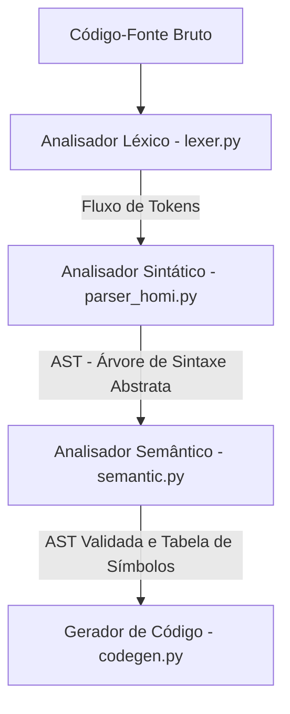

# 📖 Guia de Estudos: `semantic.py`

## 1. Resumo do Papel no Pipeline do Compilador

O **Analisador Semântico** (`semantic.py`) representa a **terceira fase** do pipeline do compilador da linguagem Homi.



### Responsabilidades Exatas:
Enquanto as fases anteriores (Léxica e Sintática) cuidam exclusivamente da **forma** e da **gramática** do código (se as palavras estão escritas corretamente e na ordem correta), o **Analisador Semântico** valida o **sentido (significado)** e a coerência lógica do programa.

Ele executa duas tarefas fundamentais:
1. **Tabela de Símbolos:** Cataloga todas as entidades do Home Assistant encontradas no código-fonte e mapeia seus respectivos domínios (a parte antes do ponto, como `light` de `light.sala`). Isso garante um inventário estruturado dos recursos gerenciados.
2. **Checagem de Tipos (Semântica Estática):** Impede inconsistências lógicas no controle de dispositivos. Por exemplo, a gramática aceita sintaticamente comandos como `- LIGAR sensor.temperatura`. Contudo, semanticamente isso é um erro grave: sensores são dispositivos exclusivamente de **leitura** e não aceitam comandos de alteração de estado. O analisador semântico valida se as ações `LIGAR`/`DESLIGAR` são aplicadas estritamente a domínios classificados como **atuadores**.

---

## 2. Desmembramento Técnico

O analisador é implementado através da classe `AnalisadorSemantico` utilizando o padrão de projeto **Visitor** para percorrer a AST de forma recursiva.

### A. Estruturas de Classificação de Domínios (Linhas 21-31)
* **`DOMINIOS_ATUADORES`**: Um conjunto contendo os domínios do Home Assistant considerados válidos para receber ações de controle (`LIGAR`/`DESLIGAR`). Exemplos: `light`, `switch`, `fan`, `cover`, `climate`, `vacuum`, `script`, `automation`, `input_boolean`, `scene`.
* **`DOMINIOS_SENSORES`**: Um conjunto contendo domínios de sensores ou de leitura física. Embora declarados no código, eles são protegidos de tentativas de alteração direta. Exemplos: `sensor`, `binary_sensor`, `sun`, `weather`, `device_tracker`, `zone`, `person`.

### B. O Padrão Visitor e os Métodos de Análise

* **`analisar(self, ast)`** (Linha 66):
  * **O que faz:** É o ponto de entrada principal do analisador. Recebe a AST (uma lista de dicionários) gerada pelo parser e itera sobre cada nó de automação invocando `_visitar_automacao`.
  * **Retorno:** Devolve `True` caso nenhum erro semântico tenha sido detectado, ou `False` caso contrário.

* **`_visitar_automacao(self, no)`** (Linha 80):
  * **O que faz:** Coordena o percurso nos blocos internos da automação (`gatilhos`, `condicoes` e `acoes`). 
  * **Resiliência:** Se a automação em análise tiver o rótulo `'tipo': 'automacao_com_erro'`, o analisador pula esse nó silenciosamente, pois sabe que a fase sintática já identificou falhas graves estruturais ali.

* **`_visitar_gatilho` (Linha 98) e `_visitar_condicao` (Linha 105):**
  * Registram todas as entidades encontradas nessas seções na Tabela de Símbolos usando a função `_registrar_entidade`.
  * Tratam os tipos: `gatilho_estado`, `gatilho_numerico`, `condicao_estado` e `condicao_numerica`.
  * Nota: `gatilho_evento` e `gatilho_horario`/`condicao_horario` não possuem entidades associadas, portanto nada é registrado.

* **`_visitar_acao(self, no, automacao_nome)`** (Linha 110):
  * **O que faz:** É onde a checagem de tipos de fato ocorre.
  * Se a ação for do tipo `acao_ligar` ou `acao_desligar`, o método:
    1. Registra a entidade na Tabela de Símbolos.
    2. Extrai o domínio (parte anterior ao `.`).
    3. Verifica se o domínio consta em `DOMINIOS_ATUADORES`. Se não constar, invoca `_adicionar_erro`, acumulando a mensagem detalhada sem interromper ou abortar a análise das demais automações.

---

## 3. Fluxo de Dados

### 📥 Entrada:
A Árvore de Sintaxe Abstrata (AST) gerada pelo analisador sintático. Exemplo de AST contendo um erro semântico:
```python
[
    {
        'tipo': 'automacao',
        'nome': '"Alerta de Movimento"',
        'modo': 'single',
        'gatilhos': [
            {'tipo': 'gatilho_estado', 'entidade': 'binary_sensor.porta', 'estado': '"on"'}
        ],
        'condicoes': [],
        'acoes': [
            {'tipo': 'acao_ligar', 'entidade': 'sensor.movimento'} # ERRO SEMÂNTICO!
        ]
    }
]
```

### 📤 Saída (Efeitos Colaterais e Retorno):
O método `analisar` retorna `False` devido ao erro. Internamente, ele popula duas estruturas fundamentais:

1. **Tabela de Símbolos (`self.tabela_simbolos`):**
   ```python
   {
       'binary_sensor.porta': 'binary_sensor',
       'sensor.movimento': 'sensor'
   }
   ```

2. **Lista de Erros Acumulados (`self.erros`):**
   ```python
   [
       {
           'automacao': '"Alerta de Movimento"',
           'mensagem': "Ação 'LIGAR' inválida para a entidade 'sensor.movimento'. O domínio 'sensor' é de leitura e não aceita comandos de estado."
       }
   ]
   ```

---

## 4. Possíveis Gargalos e Perguntas de Banca ⚠️

Preste atenção especial a estes pontos frágeis que podem motivar questionamentos do seu professor:

### 🔍 Gargalo 1: Falta de Validação de Valores de Estado
* **A Fragilidade:** O analisador semântico valida se você pode ligar/desligar um sensor, mas ele **não valida se os valores atribuídos às entidades fazem sentido**!
* **Exemplo de bug aceito:** Se você escrever `- binary_sensor.porta ESTA "disarmed"`, a análise semântica aceitará isso de braços abertos, mesmo sabendo que um sensor binário só pode assumir os estados `"on"` ou `"off"`.
* **Pergunta do professor:** *"Como você estenderia o analisador semântico para garantir que os estados informados sejam compatíveis com cada tipo de entidade?"*
* **Sua resposta:** *"Nós criaríamos um dicionário auxiliar que mapeia os domínios para seus estados permitidos (ex: `{'binary_sensor': {'on', 'off'}}`). Durante a visita aos nós de gatilho e condição, extrairíamos o domínio da entidade e verificaríamos se o valor de estado fornecido no código fonte pertence ao conjunto de valores permitidos daquele domínio."*

### 🔍 Gargalo 2: Dependência Estática de Domínios do Home Assistant
* **A Fragilidade:** O Home Assistant possui centenas de integrações e domínios. A lista `DOMINIOS_ATUADORES` é estática. Se a plataforma adicionar um domínio atuador novo, ou se você possuir um dispositivo personalizado, o compilador irá disparar um erro semântico de forma equivocada (falso positivo).
* **Solução Didática:** Na prática, em compiladores industriais, essa tabela pode ser estendida de forma dinâmica lendo um arquivo de configuração externo (como um JSON com os schemas das entidades do HA) em vez de fixá-la direto no código do compilador.

### 🔍 Gargalo 3: Alterações ao Vivo (Adicionar Novos Dispositivos!)
* **O que o professor pode pedir:** *"O Home Assistant lançou uma integração para robôs de limpeza chamada 'cleaner'. Quero que nossa linguagem Homi permita ligar e desligar esse robô. Altere o compilador."*
* **Como resolver ao vivo:**
  Você só precisa adicionar a string `'cleaner'` ao conjunto `DOMINIOS_ATUADORES` no início da classe `AnalisadorSemantico` (Linha 21-25):
  ```python
  DOMINIOS_ATUADORES = {
      'light', 'switch', 'fan', 'cover', 'lock',
      'media_player', 'climate', 'vacuum', 'script',
      'automation', 'input_boolean', 'scene', 'cleaner', # Adicionado aqui!
  }
  ```

---

### Resumo de Dicas para a Apresentação:
1. **Destaque a Resiliência (Recuperação de Erros):** Mostre como a lista `self.erros` permite que o analisador colete múltiplos problemas de uma vez. Em vez de quebrar no primeiro erro, ele apresenta uma lista limpa para o usuário corrigir tudo de uma só vez, o que melhora muito a experiência de desenvolvimento (DX).
2. **Demonstre o Relatório Visual:** O arquivo possui testes integrados que geram relatórios visuais lindíssimos de erros no console. Execute no terminal:
   ```bash
   python semantic.py
   ```
   Isso mostrará a Tabela de Símbolos e as mensagens de erro estruturadas brilhando na tela. É uma excelente forma de fechar a seção semântica da sua apresentação!

Boa sorte! Se quiser analisar a última etapa de geração de código (`codegen.py`), estou por aqui!
